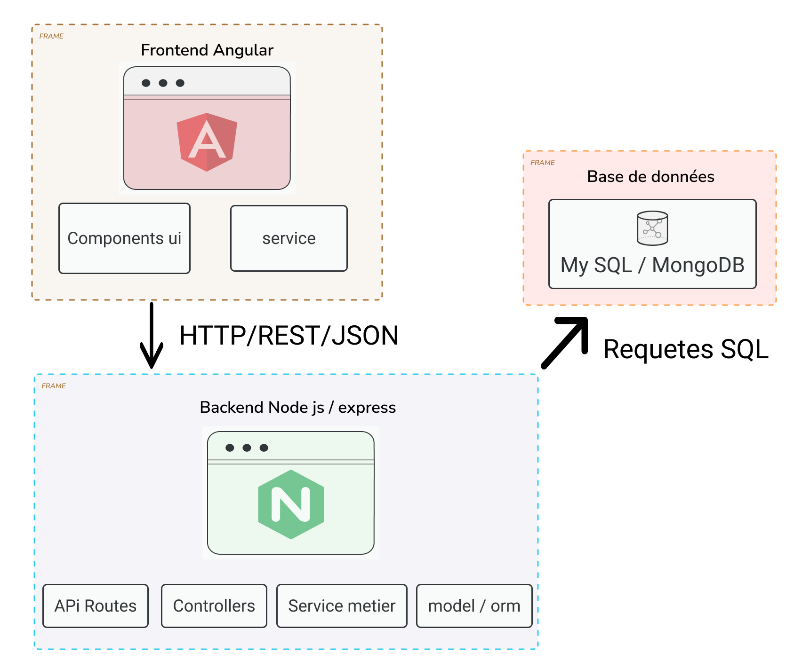

# Agile Software Engineering: Full-Stack Spring Boot & React

**members:**mariem guermazi , lakhdar ibtihel , mohamed yassine abada
**Methodology:** Scrum (Agile)  
**Architecture:** Architecture 3 tiers MVC

## 🏗️ Project Architecture


## 📋 Project Overview
This project, ShareBox, is a web-based application designed to promote object sharing between individuals instead of purchasing rarely used items. The platform aims to reduce overconsumption while encouraging an eco-friendly and collaborative community.

ShareBox allows users to create accounts, publish objects they are willing to lend, search for available objects, and request reservations. A simple messaging system enables communication between lenders and borrowers to organize the loan process.

The project follows an Agile (Scrum) approach, focusing on a limited set of core functionalities to deliver a clear and functional Minimum Viable Product (MVP).

### Key Features
- **Backend:**  Node.js with Express for REST API development.
- **Frontend:** Angular for a responsive and user-friendly interface.
- **Database:** SQL (MySQL and MongoDB) for data persistence.
- **Scrum Artifacts:** Scrum with Product Backlog and sprint-based development.
- **DevOps:** Fully containerized architecture with Docker Compose.
- **CI/CD:** Automated workflows via GitHub Actions.

## 🗄️ Database Architecture
The project features a complete, persistent database setup:
- **Containerized:** PostgreSQL runs in a dedicated Docker container.
- **Persistence:** Volume mapping (`./data/postgres`) ensures data remains available across container restarts.
- **Auto-Seeding:** A `DataSeeder` class automatically populates the database with initial users, projects, and employees on startup.
- **Tutorial:** See `tutos/deployment_docker_se.pdf` for a deep dive into persistence and orchestration.

## 🚀 CI/CD Pipeline
We use **GitHub Actions** to automate quality control:
- **Java Build:** Continuous Integration for the Spring Boot backend using Maven.
- **React Build:** Continuous Integration for the frontend using Node.js.
- **Docker Validation:** Automated build checks for Docker images to ensure deployment readiness.
- **Configuration:** Located in `.github/workflows/main.yml`.

## 🏁 Quick Start: Running the Full Stack
Ensure you have **Docker Desktop** installed, then run:

```bash
docker-compose up --build
```

- **Frontend:** [http://localhost:3000](http://localhost:3000)
- **Backend API:** [http://localhost:8080/api/projects](http://localhost:8080/api/projects)
- **H2 Console (Dev):** [http://localhost:8080/h2-console](http://localhost:8080/h2-console)

## 📂 Repository Structure
- `backend/`: Java Spring Boot source code and Dockerfile.
- `frontend/`: React source code and multi-stage Dockerfile.
- `docs/`: Scrum deliverables (Backlog, Sprint Reviews).
- `tutos/`: Generated pedagogical PDF guides (Step-by-Step).
- `scrum_artifacts/`: Complete Scrum documentation (Backlogs, DoD, Templates).
- `guide_projet.pdf`: Master project roadmap and evaluation criteria.

## 📖 Pedagogical Roadmap
1. **Sprint 0:** Environment Setup & Agile Planning.
2. **Sprint 1:** Backend Architecture (Entities, Repositories).
3. **Sprint 2:** Frontend Integration (Axios, State Management).
4. **Sprint 3:** Persistence & Containerization (Docker + Postgres).
5. **Sprint 4:** UX/UI Polish & Form Validation.

---
*© 2026 Haythem Ghazouani - Professional Software Engineering Module*
