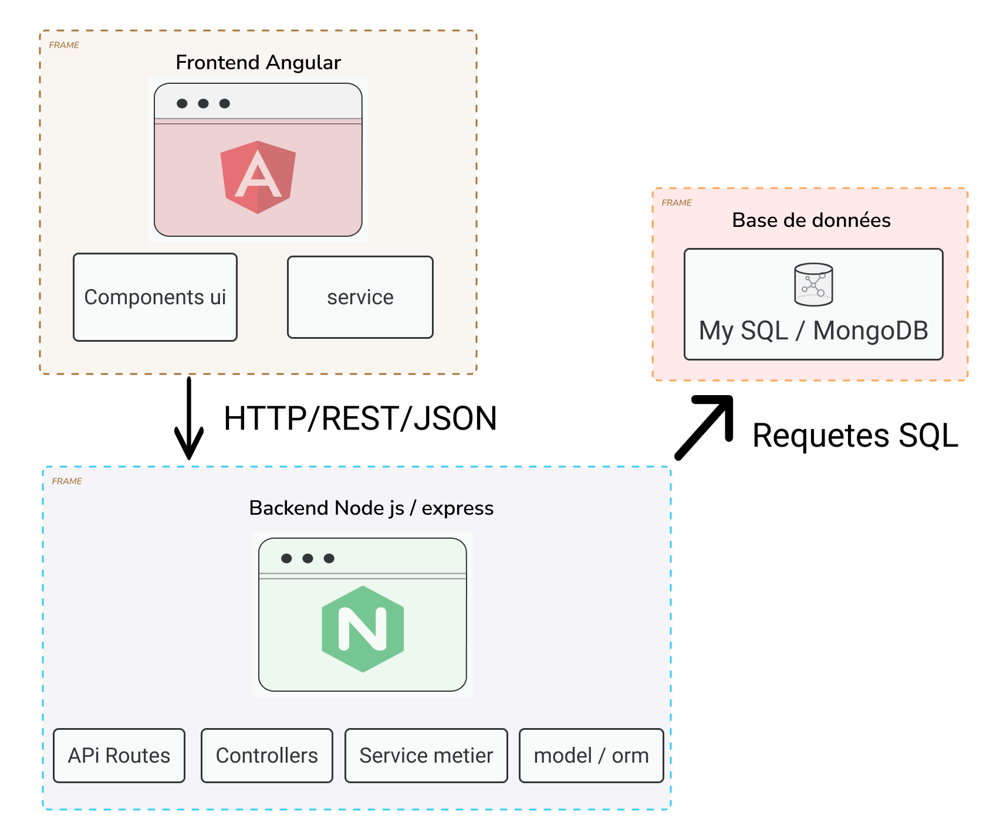

# ShareBox - Full-Stack Node.js + Angular

**Members:** Mariem Guermazi, Lakhdar Ibtihel, Mohamed Yassine Abada  
**Methodology:** Scrum (Agile)  
**Architecture:** 3-tier MVC (Frontend / API / Database)

## Project Architecture


## Project Overview
ShareBox is a web platform that promotes object sharing between users instead of buying rarely used items.

The platform allows users to:
- create accounts and login,
- publish items,
- browse available items,
- request item borrowing,
- receive notifications when requests are accepted or rejected.

The project follows Scrum to deliver an MVP with clear and usable core features.

## Tech Stack
- **Frontend:** Angular 19
- **Backend:** Node.js + Express
- **Database:** MySQL
- **Authentication:** JWT
- **Versioning/CI:** GitHub + GitHub Actions

## Implemented Features
- User registration and login
- JWT-based authentication
- Protected actions/routes
- Publish new item
- Browse items and item details
- Borrow request flow
- Owner accept/reject flow
- Notifications in navbar (count + dropdown, per user)

## Notifications
- API endpoint: `GET /notifications/:userId`
- Source: `notifications` table in MySQL
- Frontend: bell icon in navbar with badge and dropdown
- Status colors:
- `accepted` in green
- `rejected` in red

## API Overview
### Auth
- `POST /api/auth/register`
- `POST /api/auth/login`

### Items
- `GET /items`
- `GET /items/:id`
- `POST /items` (auth required)

### Borrow Requests
- `POST /borrow-requests` (auth required)
- `GET /borrow-requests/user/:id`
- `GET /borrow-requests/owner/:id`
- `PUT /borrow-requests/:id` (accepted/rejected)

### Notifications
- `GET /notifications/:userId`

## Database
Main tables:
- `users`
- `items`
- `borrow_requests`
- `notifications`
- `categories`

## Local Run
### 1) Backend
```bash
cd backend
npm install
```

Create a `.env` file in `backend/`:
```env
PORT=5000
DB_HOST=localhost
DB_USER=your_mysql_user
DB_PASSWORD=your_mysql_password
DB_NAME=sharebox
JWT_SECRET=your_jwt_secret
```

Run backend:
```bash
node app.js
```

### 2) Frontend
```bash
cd frontend
npm install
npm start
```

Default URLs:
- Frontend: `http://localhost:4200`
- Backend API: `http://localhost:5000`

## Repository Structure
- `backend/`: Express API (controllers, routes, middleware, config)
- `frontend/`: Angular application (components, services, guards)
- `docs/`: project documentation and diagrams
- `scrum_artifacts/`: Scrum artifacts and templates
- `tutos/`: support and tutorial documents

## Scrum Roadmap
### Sprint 1
- User registration
- User login
- Password hashing
- JWT authentication
✅ Completed

### Sprint 2
- Protected routes/actions
- Dashboard and core navigation
✅ Completed

### Sprint 3
- Borrow request management
- Owner-side accept/reject workflow
✅ Completed

### Sprint 4
- Modern responsive UI improvements
- Notification system (navbar bell + dropdown)
✅ Completed

---
*© 2026 ShareBox Project - Agile Software Engineering Module*
