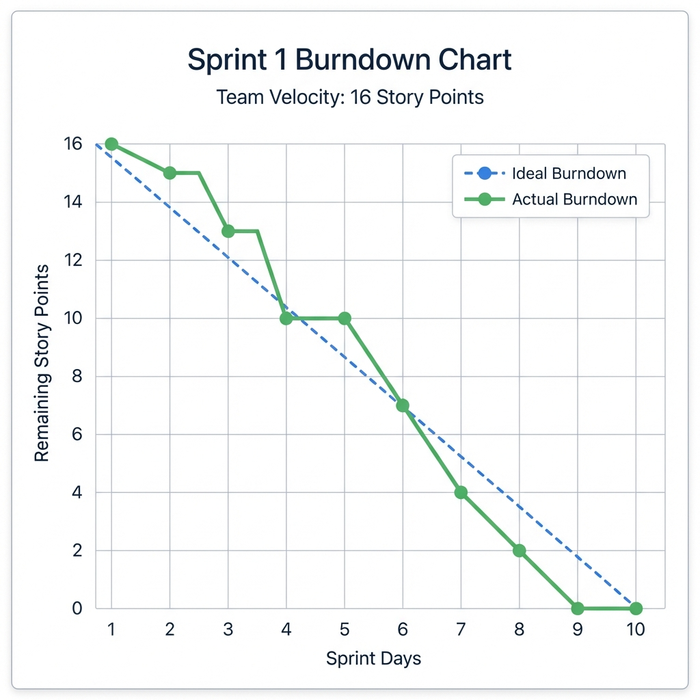
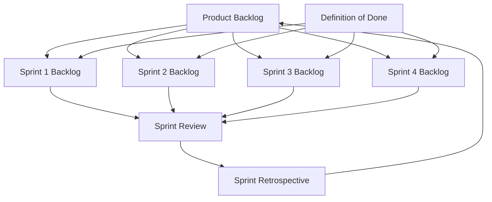

# Scrum Artifacts

This folder contains comprehensive Scrum artifacts for the **Project Portfolio Dashboard** prototype. These documents serve as templates and examples for students learning Agile Software Engineering.

---

## 📂 Contents

| File | Description |
|------|-------------|
| [product_backlog.md](product_backlog.md) | Complete Product Backlog with 10 prioritized user stories |
| [sprint_1_backlog.md](sprint_1_backlog.md) | Sprint 1 detailed backlog with task breakdown |
| [sprint_2_backlog.md](sprint_2_backlog.md) | Sprint 2 detailed backlog with task breakdown |
| [sprint_3_backlog.md](sprint_3_backlog.md) | Sprint 3 detailed backlog with task breakdown |
| [sprint_4_backlog.md](sprint_4_backlog.md) | Sprint 4 detailed backlog with task breakdown |
| [definition_of_done.md](definition_of_done.md) | DoD criteria at task, story, sprint, and release levels |
| [sprint_review_template.md](sprint_review_template.md) | Reusable template for Sprint Review meetings |
| [sprint_retrospective_template.md](sprint_retrospective_template.md) | Start-Stop-Continue retrospective template |
| [burndown_chart_sprint1.png](burndown_chart_sprint1.png) | Visual burndown chart example |

---

## 📊 Burndown Chart Example

---

## 🎯 How to Use These Artifacts

### For Students
1. **Copy the templates** to your own project folder
2. **Customize** the user stories to match your team's project
3. **Fill in** task breakdowns and estimates during Sprint Planning
4. **Update** burndown charts daily during the Sprint
5. **Complete** Sprint Review and Retrospective documents at Sprint end

### For Instructors
These artifacts can be used as:
- Reference examples during lectures
- Grading rubrics for Scrum deliverables
- Templates distributed to student teams

---

## 📋 Artifact Relationships

---

## 📈 Velocity Summary

| Sprint | Planned | Completed | Velocity |
|:------:|:-------:|:---------:|:--------:|
| 1 | 16 SP | 16 SP | 100% |
| 2 | 13 SP | 13 SP | 100% |
| 3 | 13 SP | 13 SP | 100% |
| 4 | 13 SP | 13 SP | 100% |

**Total:** 55 Story Points delivered across 4 Sprints

---

## ✅ Checklist for Complete Scrum Documentation

When submitting your project, ensure you have:

- [ ] Product Backlog with prioritized user stories
- [ ] Sprint Backlogs for each sprint
- [ ] Burndown charts (can be hand-drawn or digital)
- [ ] Sprint Review notes
- [ ] Sprint Retrospective notes
- [ ] Definition of Done document

---

*These artifacts are aligned with the Project Portfolio Dashboard prototype and demonstrate industry-standard Agile practices.*
